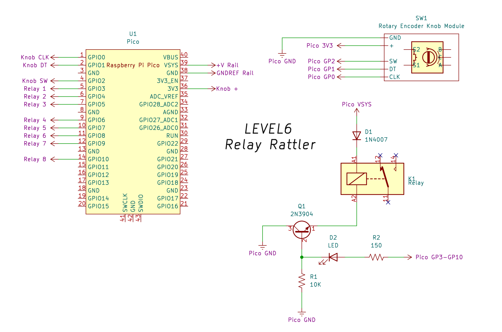
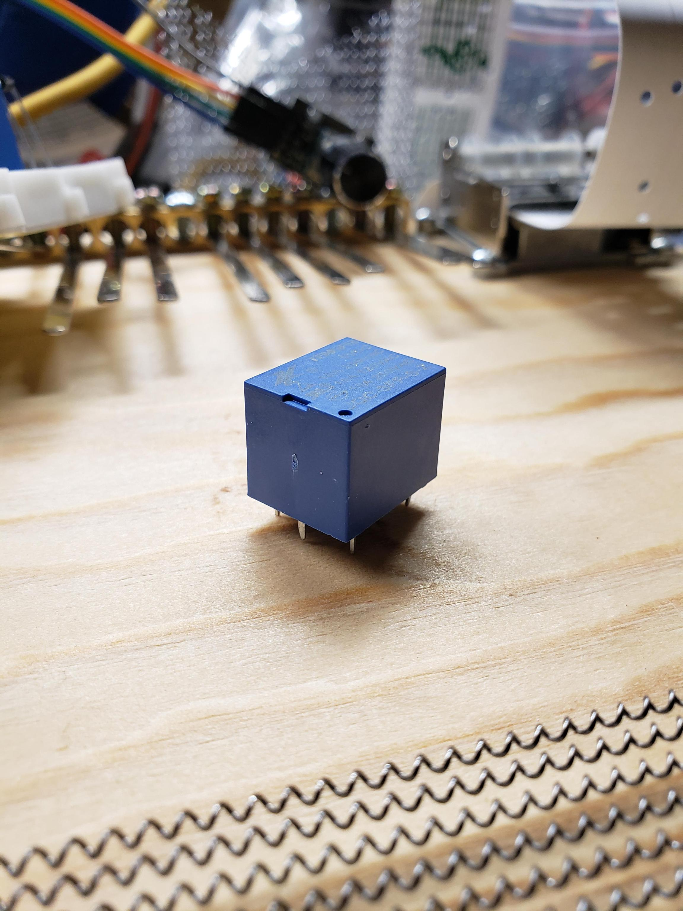
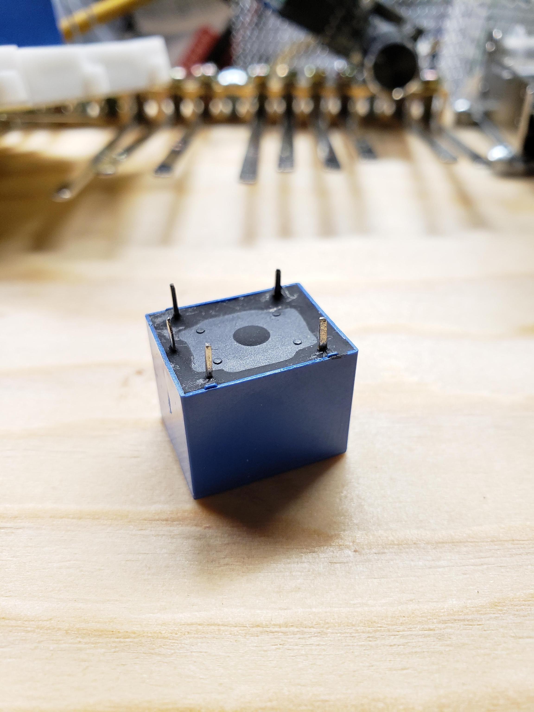

## Relay Rattler

<link rel="stylesheet" type="text/css" href="css/github.css"> 
 
<h1 align="center"> 
  
</h1> 

Use an RPi Pico microcontroller to make rhythms on an array of mechanical relays  

## Table of contents:

* [Relay Rattler](#relay-rattler) 
* [Table of Contents](#table-of-contents) 
* [Description](#description)
	* [Why?](#why)
* [Theory of Operation](#theory-of-operation) 
	* [Hardware Components](#hardware-components)
	* [Software Components](#software-components)
	* [Usage](#usage)
	* [Other Ideas](#other-ideas)
* [Requirements](#requirements)
* [Build](#build)
	* [Hardware](#hardware)
	* [Software](#software)

## Description:
[Table of Contents](#table-of-contents)

The "Relay Rattler" is a simple array of electromagnetic relays set up to be triggered by the output pins of a Raspberry Pi Pico (RP2040) and controlled by a rotary push knob module also hooked into the Pico.  The circuit was kept minimal, as we only need to trigger the switch to get the "clack" sound on and off and are not actually handling any load on the other side of the relays.  This design should be easily ported to any microcontroller you have on hand, and is easily expandable to larger arrays of relays as well as different relay configurations, all allowing for a lot more experimentation on your part.

The code has been kept very simple, as well.  Basic delays are used to get us "mostly there" and functional, without the complexity of asyncio, threading, etc.  You are, of course, welcome to expand on that and make it much better than it is.

### Why?:

Relay Rattler was built as an addition to a new "noise box" I am building.  I just wondered what an old clickity-clack style mechanical relay would sound like if it were triggered inside of one.  Then, I wondered what 8 of them would sound like.  Then, I wondered if they could be "sequenced" in different patterns with a little speed control.  And, here we are - with many more unanswered questions.  I hope someone can have some fun answering their own.

## Theory of Operation:
[Table of Contents](#table-of-contents)

We will refer to the following diagram for this explaination:

<h1 align="center"> 
  
</h1> 

### Hardware Components:

The most important thing to remember about this project is that no load is being triggered on the other side of the relays.  We are only turning the relays on/off in patterns without driving anything else.  So, a minimal voltage is required.  The 5V relays I am using have been working fine using only the 3V3 rail of the Pico.  

U1 is of course the microcontroller which contains all of the programming for this.

SW1 is a rotary encoder knob module that translates continuous knob rotation into bits to be translated to "clockwise" or "counter-clockwise" on the Pico via the "DT" and "CLK" lines.  The knob also has a push switch function which triggers the SW line.  The knobs I used are rated for 5V, but have been fine with the 3V3 of the Pico.

K1 is the relay.  You might need to use a meter or small battery to hit pins and figure out which two will trigger the coil inside.  If you have access to a datasheet, that may also tell you.  Schematic symbols are odd and it is difficult to find an exact match for off-brands, so don't go by this one.  I found that mine had three pins on one side (the side with the dot for pin 1), and two pins on the opposite end.  I determined that two of the three pins on the pin 1 side worked the coil.  I had to bend over the middle pin to get it to fit well in the breadboard.

Here are what my relays look like:

<h1 align="center"> 
  
  
</h1> 

So, that middle pin on the left side in the photo on the right was simply bent down flat.  You could likely snip it, for this.

D1 is a general purpose 1N4007 diode.  You don't need anything super fast/fancy, here.  The purpose of this diode is to block any flyback current from the coil (as it switches off and the coil discharges) from reaching the Pico and blowing out the GPIO.  

Q1 is a generic BJT NPN 2N3904 transistor.  This is being used to logically switch the relay coil on/off, as well as an LED, using the GPIO pin data we send.

R1 is just any high-ish value (I used 10K) resistor that is being used as a "pull-down" to keep the circuit in a default off state.  You never want to leave the base pin of a transistor "floating" in an unknown state, and since we want these relays to default to off, we use a "pull-down".

R2 is a lower valued (150) resistor which is just limiting current through the LED so it doesn't burn out too soon.  It could have probably been a slightly higher value (I didn't look amber up in charts), but this should do well, since these are not on for very long, and we are really dealing with such low currents on the Pico.  (Can you tell I am not en electronic engineer?)

D2 happens to be an amber LED I had handy.  There are charts you can look LEDs up on to get a better idea what currents they need and then use Ohm's Law to figure out R2 more precisely.  This usually depends on the elements they are doped with (color).  But, the ranges are 100-220 ohms for 5V, typically.  If these start to burn out on me, I will put up more detail on that.  Since the Relay Rattler will live inside an enclosed Noice Box, I'm not especially concern if they burn out.  They were only used for development, to know where I was on the array as I twisted the knob.

All "Pico GND" connections should be connected together on a common rail.  If 5V is used to power the Pico, this will also be used for the rest of the relay circuit.  Since the rotary knob is using the dedicated 3V3 pin, you want all of these things referenced from the same 0.

All "Pico VSYS" connections should similarly be connected to the same rail.

The "Pico GP3-10" connections are just one relay per GPIO pin on the Pico, for 8 relays, thus 3 through 10.  If you add more, you can continue on up GP22, if you like.  Just remember that your code will need to change to know about these pins, as well.   As the code stands, you can get up to 8 relays going at once.

### Software Components:

### Usage:

Simply apply power to the Pico, and everything should begin to work.  There is no on/off control.  The program will default to "Mode 1", which allows the user to turn the rotary encoder left and right to rifle up and down the relay array as fast/slow as they like.  Pushing the rotary encoder knob will change modes in "Mode 2" and "Mode 3" (more to come!).  In these modes, the rotary encoder left/right turns into a speed control for the pre-programmed 16-step patterns.  Here is a breakdown of the modes:

* Mode 1 - Spin the knob clockwise/counter-clockwise to manually rifle up/down the relays
* Mode 2 - Spin the knob clockwise to raise the delay or counter-clockwise to shorten the delay in the repeating 16-step pattern.
* Mode 3 - Spin the knob clockwise to raise the delay or counter-clockwise to shorten the delay in the repeating 16-step pattern.

The 16-step pattern in Mode 2 is a very simple one that will trigger the relays one-at-a-time, up then back down the array, ending on an "all on".  The 16-step pattern in Mode 3 was an attempt to get a "boom-tiss-snap-tiss" pattern, accented on the first step, by triggering different patterns of multiple relays at the same time.

If you are using this inside of a noise box, you will probably want to mount the knob on top, then run proper power through a hole in the back.  I have only yet draped them in and have gotten really great sounds out of this.  Here is the first "song" I made using it as a ryhtmic backing to a dark, ambient minimal work: https://www.youtube.com/watch?v=33oogY_21sU .  It is that soft "clockworks" sound you hear throughout most of that song.

### Other Ideas:

The most obviously immediate idea is to expand this up to 12, 16, even 32 relays, to see when the delay tricks break down and asyncio needs to be used.  Could one go for more identifiable percussive sounds, using 32?   What if one used 16 large and 16 small relays?  Could one conjor up the "tiss" of a closed hihat?  The "snap" of a snare sidestick?

One thing I will be exploring further is how the arrangement of these 16 relays in the bottom of the box can affect the sound.  Could putting them into a circle, with the pick-up piezo mic in one far corner give a sort of "doppler effect", as they traveled around in a circle?  Or, does doppler effect only happen when sounds travels through the air?  Could more and less volume be controlled by arrangement?

What about solenoids?   A good push/pull solenoid could be made to tap on just about anything.  Solenoids hitting glass?  A sheet of tin?  Tuning forks?!  oooo... a MIDI-controlled Kalimba?

It feels like this could be a bottomless pit of fun exploration for folks.

## Requirements:
[Table of Contents](#table-of-contents)

You will need the following hardware to duplicate this project, although much substitution is possible given a little thought:

(Don't worry.  None of these are affiliate links.)

* Raspberry Pi Pico RP2040 (Original or clones should work.  I used one of these: https://www.amazon.com/dp/B092S2KCV2)
* 5V SPST electromagnetic coil relays (I used 8 of these: https://www.amazon.com/dp/B088PLWFN1)
* General purpose BJT NPN transistors (I used 8 2N3904's from this kit: https://www.amazon.com/dp/B06Y49GB3F)
* Rotary encoder knob module (I used one of these: https://www.amazon.com/dp/B07F26CT6B)
* General purpose diodes (I used 8 1N4007's from this kit: https://www.amazon.com/gp/product/B007L4DX6Q)
* 150 Ω 1/4W resistor (I have so many E12 kits, not sure which I pulled from.)
* 10K Ω 1/4W resistor (I have so many E12 kits, not sure which I pulled from.)
* Amber LED (Again... easy to source.   Not much current is going through this for long.  Don't worry about color too much.)
* Breadboard... jumper wire... eventually perfboard, a soldering iron, solder, etc., if you go that way.
* A computer with Thonny to get the MicroPython code onto the Pico (or, use your favorite method)
* You can power the Pico however you desire.  I have used it powered on from the computer USB and with a dedicated regulated 5V supply of my own design.  A battery pack might work, too.  Remember, we are only triggering the switch in the relay, not actually running any load on the other side of it.

## Build:
[Table of Contents](#table-of-contents)

### Hardware:

### Software:

